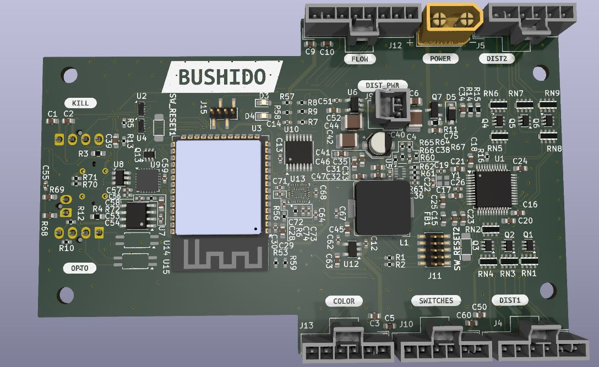

# samurai_hardware
Sumo Robot - Main Board

## Description

This repository contains the hardware design files for the main board of the HIRO 2024 sumo robot. The main board is responsible for the following tasks:

- Running the control algorithm
- Optical sensor reading
- Reading IMU data
- Communicating with the motor drivers

